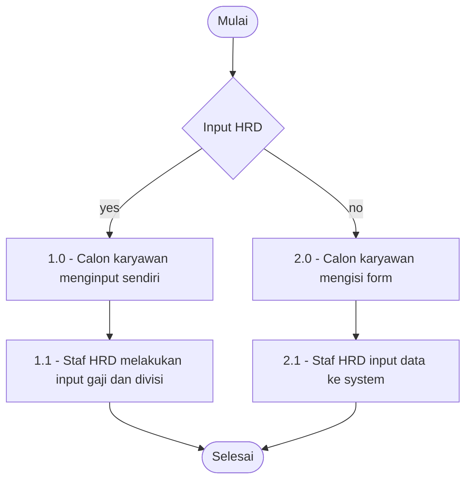
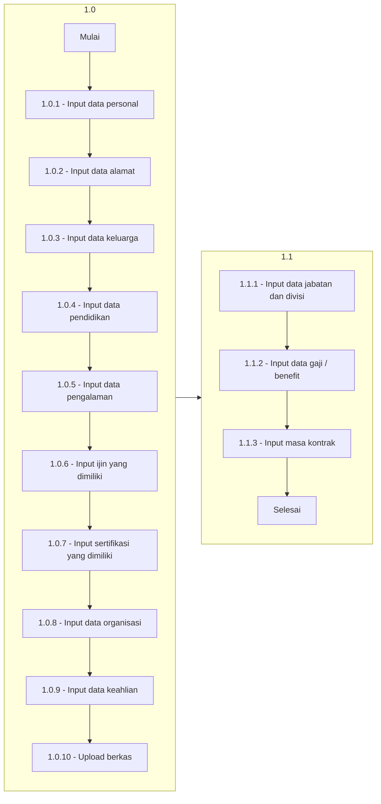
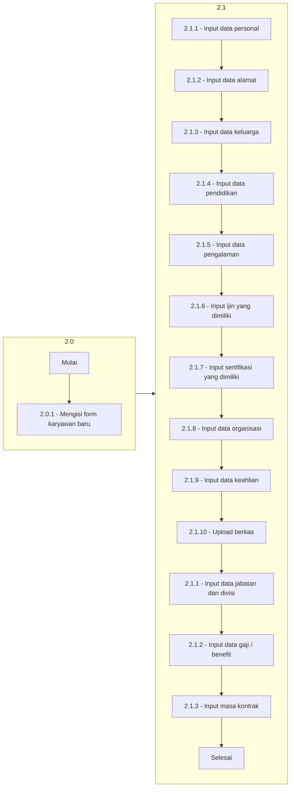

# Onboarding Karyawan

Flow ini menjelaskan flow karyawan baru saat bergabung dengan RS Yarsi,
Ada dua flow yaitu self service artinya user / karyawan mengisi data secara
mandiri atau di inputkan oleh staf HRD.

## Global Flowchart

Flowchart global onboarding karyawan
 

## Karyawan input sendiri

Flowchart karyawan input data sendiri
 

## Diinput oleh staf

Flowchart staff HRD input data karyawan
 
