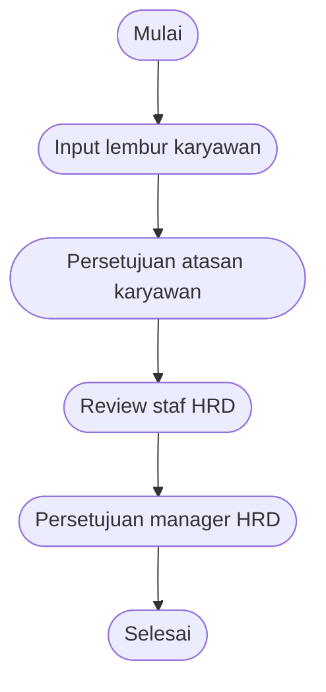
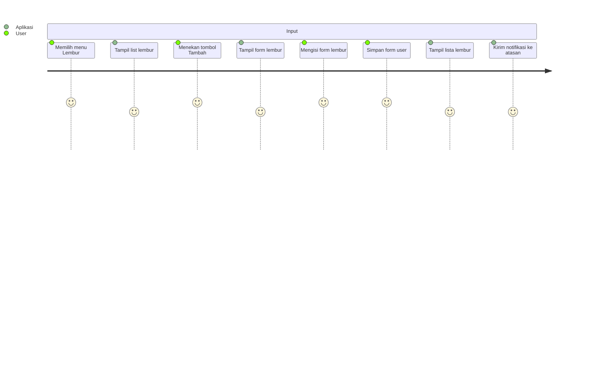
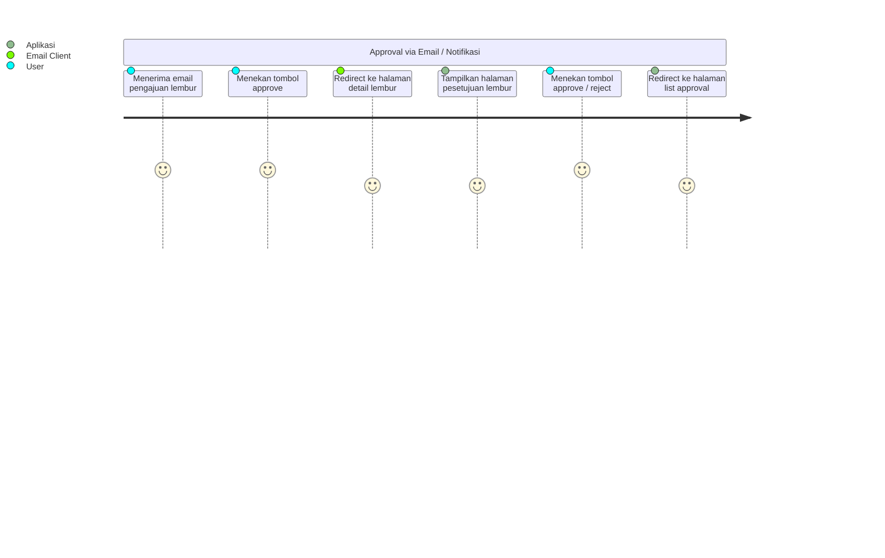
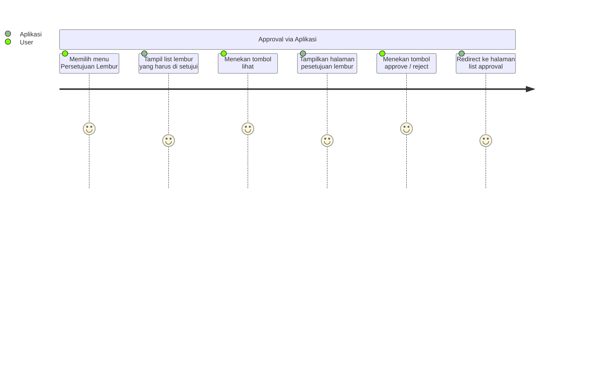
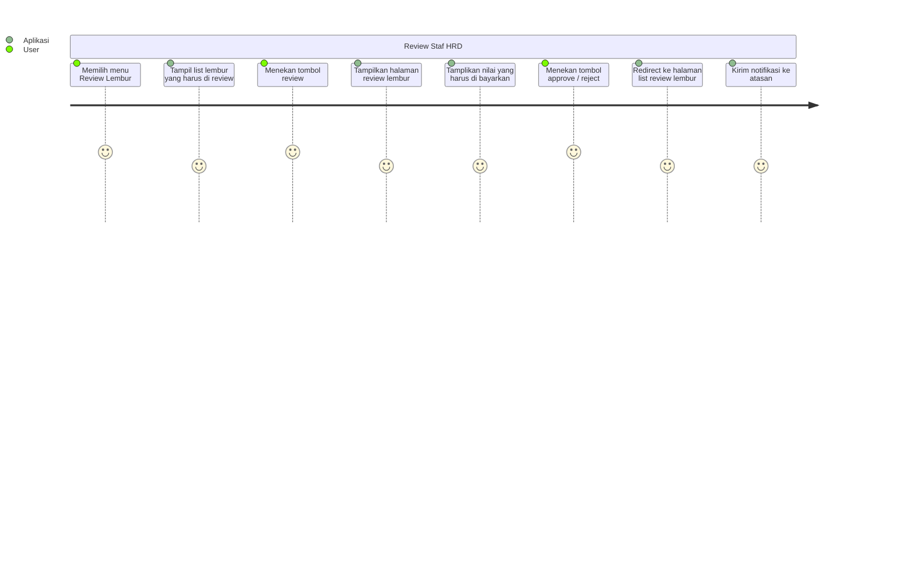

# Lembur Karyawan

Flow ini menjelaskan alur pengajuan dan persetujuan lembur oleh karyawan

## Global Flowchart



1. Karyawan melakukan penginputan pada sistem, memasukan informasi waktu lembur
2. Atasan karyawan melakukan approval untuk lembur yang di ajukan
3. (Opsional) Staf HR melakukan review lembur yang sudah di setujui atasan, sistem akan menghitung nominal lembur yang harus di bayarkan
4. (Opsional) Manager HR melakukan approval review yang dilakukan staf HR
5. Semua nonimal rupiah yang harus di bayarkan akan masuk ke dalam proses payroll
6. Nominal pembayaran muncul saat di point 4 atau 2 apabila point 3 dan 4 tidak ada

## User Journey

### Input lebur karyawan



### Persetujuan atasan karyawan





### Review Staf HRD



### Persetujuan manager HRD


```mermaid
journey
    section Approval via Aplikasi
        Memilih menu Persetujuan Lembur : 5 : User
        Tampil list lembur yang harus di setujui : 4 : Aplikasi
        Menekan tombol lihat : 5 : User
        Tampilkan halaman pesetujuan lembur : 4 : Aplikasi
        Menekan tombol approve / reject : 5 : User
        Redirect ke halaman list approval : 4 : Aplikasi