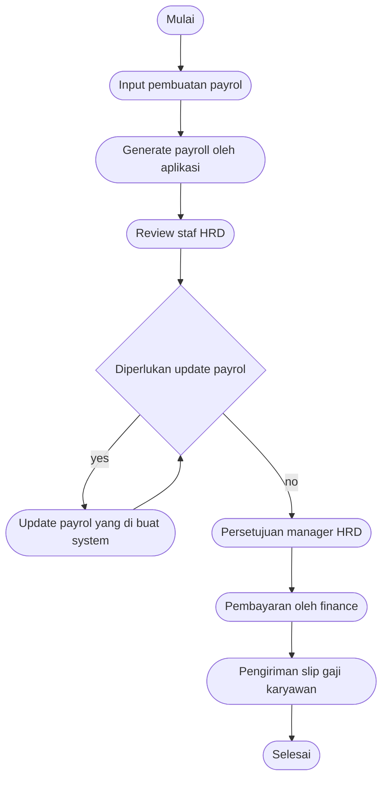
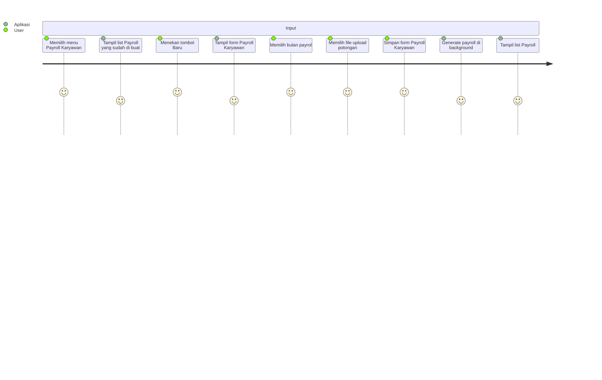
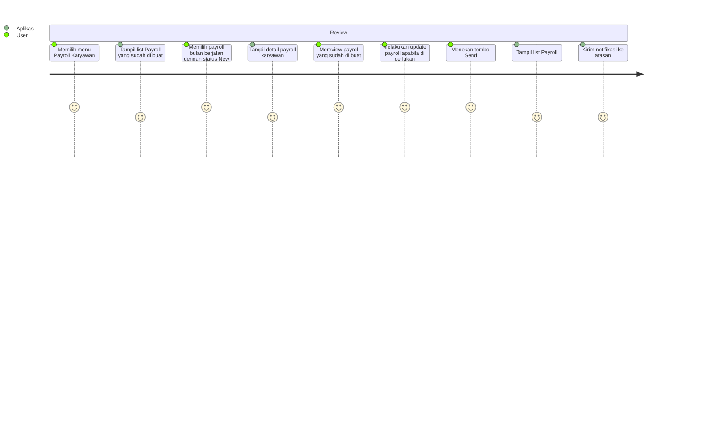
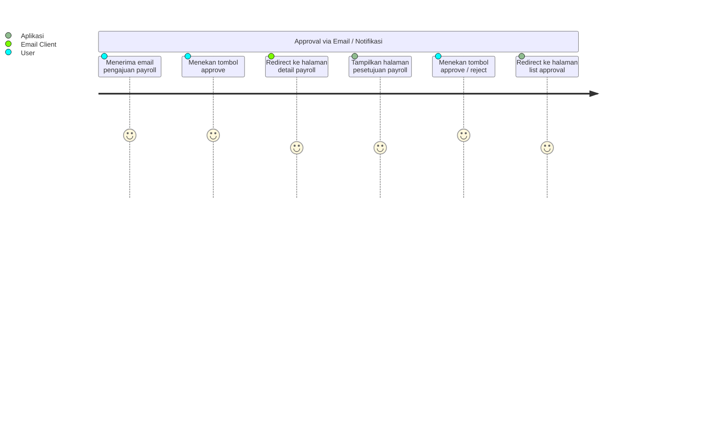
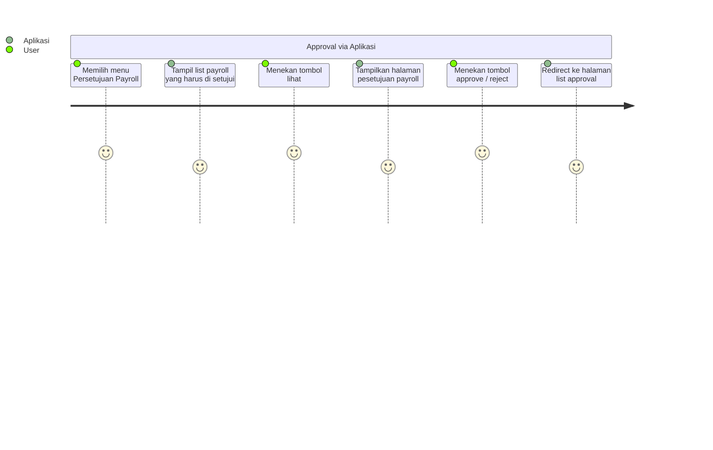
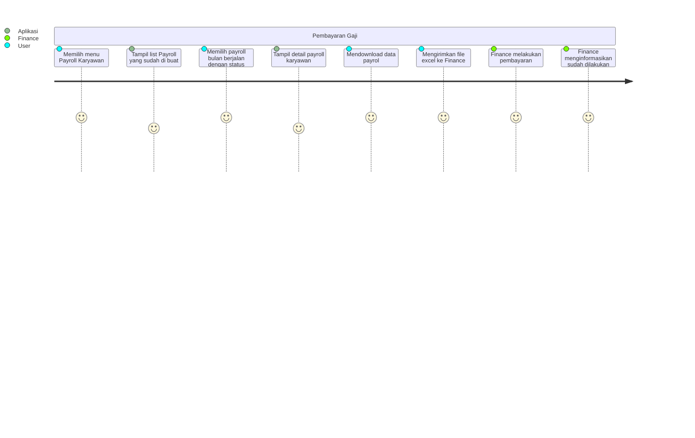
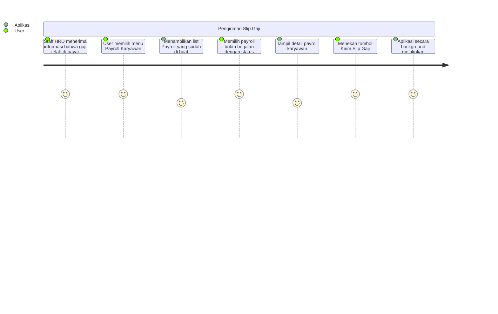

# Pengajian

Flow ini menjelaskan alur pengajuan dan persetujuan gaji oleh staf HRD

## Global Flowchart

1. Staf HRD melakukan pembuatan payrol bulan berjalan

   a. Upload potongan karyawan

2. Staf HRD akan mereview hasil generate dari payroll dari aplikasi
3. Staf HRD melakukan update apabila di perlukan
4. Staf HRD mengajukan payrol untuk selanjutnya di setujui oleh Manager HRD
5. Manager HRD melakukan review dan persetujuan

## User Journey

### Input pembuatan payrol

### Review staf HRD

### Persetujuan manager HRD

### Pembayaran oleh Finance

### Pengiriman slip gaji karyawan

