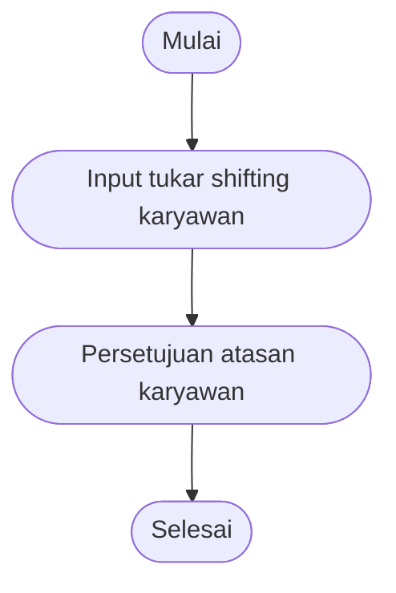
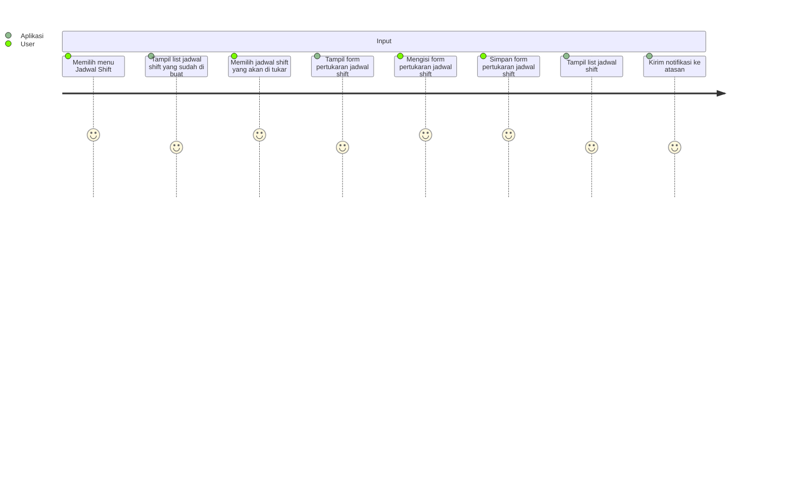
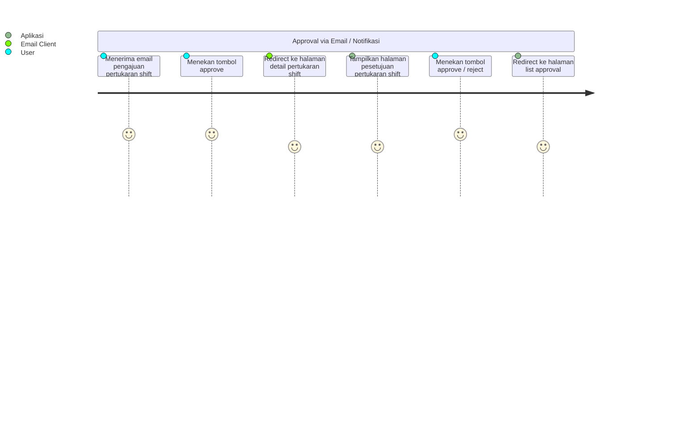
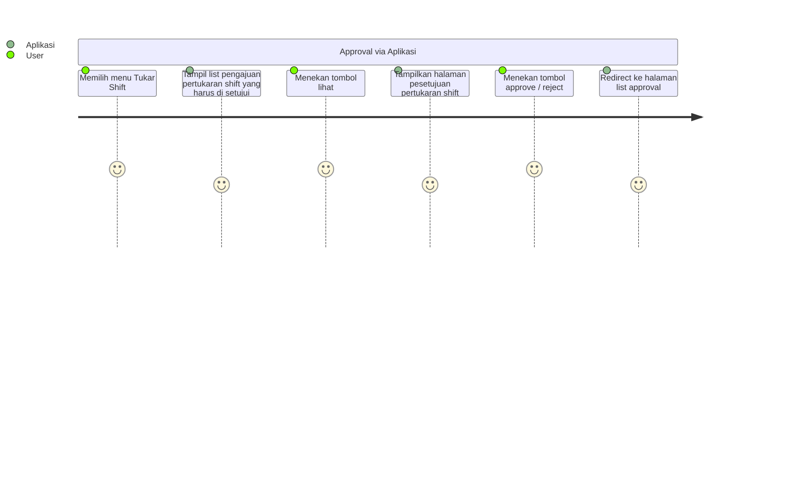
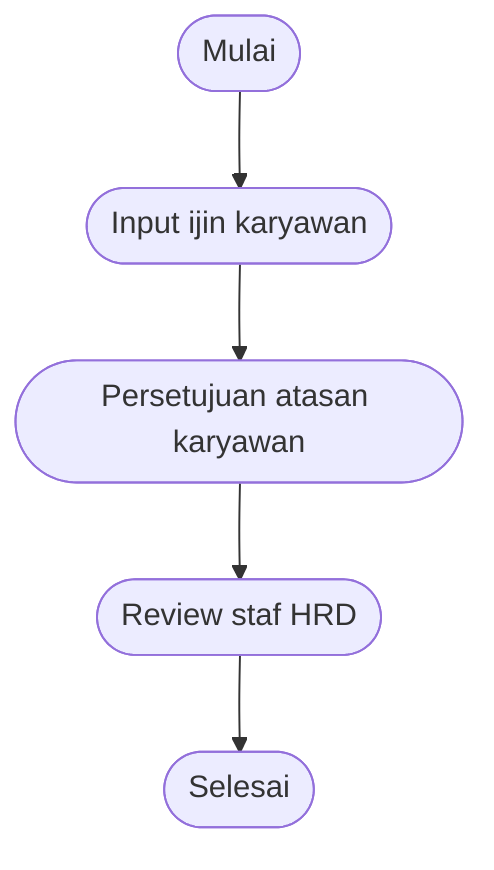
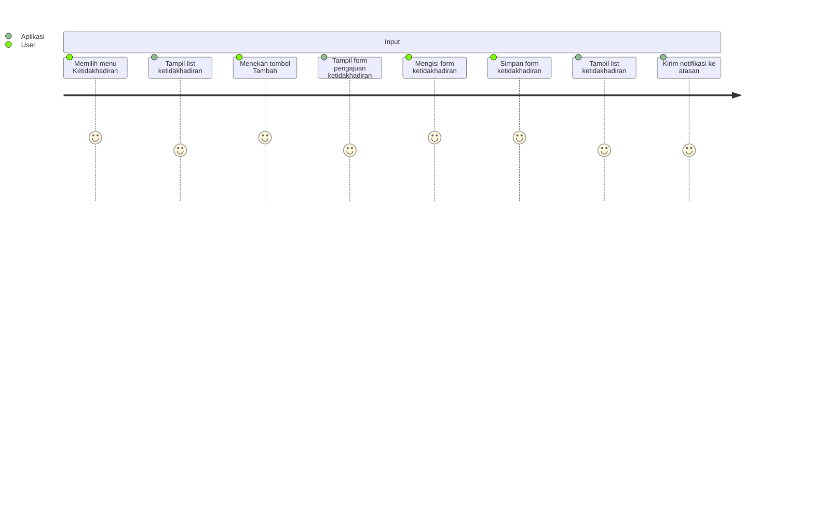
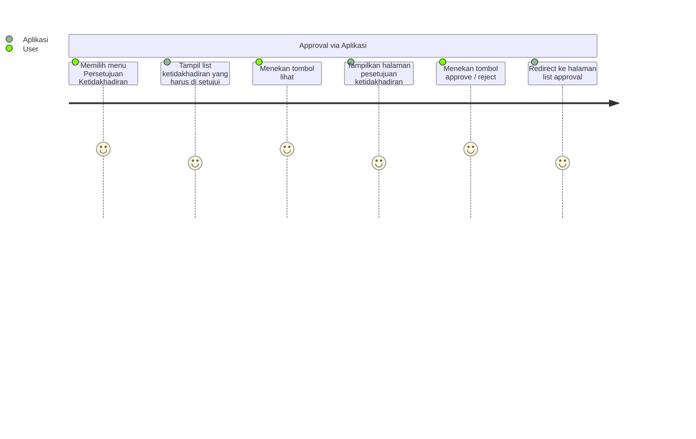

# Presensi

Presensi secara umum terdiri dari

1. Management shifting karyawan
2. Management ijin karyawan, cuti maupun ijin lainnya

## Pembuatan Shifting

Catatan :

1. Head / manager karyawan membuat jadwal shif secara berkala
2. Apakah di perlukan approval atasan ?

## Tukar Shifting

### Global Flowchart

1. Karyawan melakukan penginputan pada sistem, memasukan informasi pertukaran shifting
2. Atasan karyawan melakukan approval untuk pertukaran shifting yang diajukan
3. Sistem akan mengirimkan informasi pertukaran kepada user yang mengajukan dan user yang jadwalnya di tukar

### User Journey

#### Pengajuan tukar shifting

#### Persetujuan tukar shifting

## Ijin karyawan

### Global Flowchart

1. Karyawan melakukan penginputan pada sistem, memasukan informasi waktu ijin
2. Atasan karyawan melakukan approval untuk ijin yang diajukan
3. Staf HR melakukan review ijin yang sudah di setujui atasan
4. Apabila ijin adalah cuti maka akan mengurangi hak cuti karyawan

### User Journey

#### Pengajuan ijin karyawan

#### Persetujuan ijin karyawan

